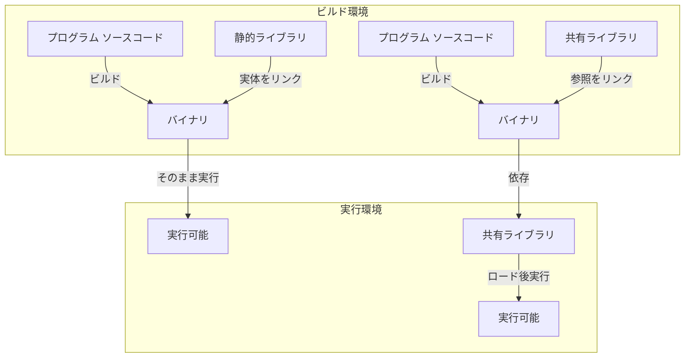

# はじめに
こんにちは、[be3](https://twitter.com/Blossomrail) です！
Microsoft Azure Tech Advent Calendar 2024 - 6日目の記事になります。
https://qiita.com/advent-calendar/2024/microsoft-azure-tech

こちらの記事では、Azure Functions に Go アプリケーションをデプロイする際の注意点やバイナリの実行形式などに関してご紹介します。
# Azure Functions に Goアプリケーション をデプロイする
## 注意点
結論からお伝えすると、以下の注意点に気を付けて[カスタム ハンドラー](https://learn.microsoft.com/ja-jp/azure/azure-functions/functions-custom-handlers)関数を作成する必要があります。
- 静的リンクでビルドしたバイナリを使用する
- 実行環境の OS、CPU アーキテクチャに合わせてビルドしたバイナリを使用する

例えば、Linux、AMD64 環境の場合、コマンドにすると以下のような形になります。
```sh
CGO_ENABLED=0 GOOS=linux GOARCH=amd64 go build handler.go
```

以降では、バイナリの実行形式やGoの仕様に関して解説が中心になるので、「動けばヨシ！」という方は以降の節の [デプロイまでの一連の手順](#デプロイまでの一連の手順) の節だけ読んでいただいても大丈夫です。

## 静的リンクと動的リンク
本題に入る前にプログラムのビルドにおける静的リンクと動的リンクについて簡単に説明します。

プログラムを実行するためには、プログラムが依存するライブラリが必要です。プログラムが依存するライブラリは、プログラムのバイナリにリンクされることでプログラムが実行可能になります。このリンクの方法には、以下の2種類があります。
- 静的リンク（static link）
- 動的リンク（dynamic link）

静的リンクで作られたバイナリは、実行時に必要なライブラリがすべてバイナリに含まれているため、実行環境にライブラリがインストールされていなくても実行することができます。
一方で、動的リンクで作られたバイナリは、起動時や実行時に必要なライブラリ（共有ライブラリ）を実行環境から別途インストールする必要があります。
:::message
ここで言う「ライブラリ」とは、OSが提供する C や C++ の標準ライブラリやシステムコールのラッパー関数などを指します。
:::

静的リンク（下図の左）と動的リンク（下図の右）の違いを下記の図に示します。

:::message
分かりやすさのため、プログラム ソースコードからバイナリに変換されるステップとして表現しましたが、実際にはソースコード→オブジェクトファイル→バイナリというステップで変換されます。
:::
つまり、静的リンクで作られたバイナリは、実行環境にライブラリがインストールされていなくても実行することができますが、動的リンクで作られたバイナリは、実行環境にライブラリがインストールされていないと実行することができません。

## 実行環境に合わせてビルドする
Azure Functions で Go のサーバー アプリケーションを実行する場合、以下の MS Learn をまず読むことになるかと思います。

https://learn.microsoft.com/ja-jp/azure/azure-functions/create-first-function-vs-code-other?tabs=go%2Cwindows

しかし、上記の MS Learn に記載された手順に従ってデプロイを進めると下記画像のように関数アプリ上に関数が表示されません。

また、エラーメッセージとして以下の内容が出力されます。
```
Encountered an error (InternalServerError) from host runtime.
```

上記の MS Learn では[下記のコマンドを実行する](https://learn.microsoft.com/ja-jp/azure/azure-functions/create-first-function-vs-code-other?tabs=go%2Clinux#compile-the-custom-handler-for-azure)ように記載されていますが、このコマンドには `CGO_ENABLED=0` が明示されていません。
```sh
$ GOOS=linux GOARCH=amd64 go build handler.go
```
この場合、関数アプリにデプロイされるバイナリは動的リンクされたライブラリを使用している可能性があるため、Azure Functions で実行することができないかもしれません。

そこで、ビルドしたバイナリが静的リンクされているかどうかを実際に確かめる必要があります。
例えば、`file` コマンドや `ldd` コマンドを使用して確認することができます。

`file` コマンドを使用して確認した場合、 `statically linked` と表示され、バイナリが静的リンクされていることを示しています。
```sh
$ file handler
handler: ELF 64-bit LSB executable, x86-64, version 1 (SYSV), statically linked, Go BuildID=oq4JP3onhVtocYn-sYWp/nj5VUT1DmvBEUpoTSOBU/S91RIYE-8-Gc7PSeh_WW/xlGrTLJkfq2uiEVzet-m, with debug_info, not stripped
```
また、 `ldd` コマンドを使用して確認した場合、 `not a dynamic executable` と表示されることが静的リンクされていることを示しています。
```sh
$ ldd handler
    not a dynamic executable
```
反対に、バイナリが動的リンクされていると、 `file` コマンドの出力に `dynamically linked` と表示されます。
```sh
$ file handler
handler: ELF 64-bit LSB executable, x86-64, version 1 (SYSV), dynamically linked, interpreter /lib64/ld-linux-x86-64.so.2, Go BuildID=VlLnMEPRq_cFTJBCKAqk/BTY6C1gIvK48gs6mI7G7/oICDG8IE90mEWrxGGpCS/PWY5azyc1oQVx0NeVxoU, with debug_info, not stripped
```
また、`ldd` コマンドを使用した場合、以下のような結果が得られ、バイナリが共有ライブラリを参照していることが分かります。
```sh
$ ldd handler
        linux-vdso.so.1 (0x00007fff2cdd6000)
        libc.so.6 => /lib/x86_64-linux-gnu/libc.so.6 (0x00007fc527238000)
        /lib64/ld-linux-x86-64.so.2 (0x00007fc52746a000)
```

実際に、私の環境でドキュメントに従ってビルドしたバイナリの実行形式を `ldd` コマンドで確かめた結果、ビルドしたバイナリが動的リンクされていることが分かりました。
Linux、AMD64 の実行環境をデプロイ先として下記のコマンドでビルドし直したところ、冒頭で記載したエラーメッセージが表示されず、関数アプリ上に関数が表示されアプリケーションが正常に動作しました。
```sh
$ CGO_ENABLED=0 GOOS=linux GOARCH=amd64 go build handler.go
```

以上の結果から、 Azure Functions カスタム ハンドラーの実行環境には必要な共有ライブラリがインストールされていなかったのだと推測しています。
基本的に PaaS サービスである Azure Functions で実行環境をユーザーがカスタマイズすることは難しい/避けるべきであるため、静的リンクされたバイナリを使用することが望ましいと考えられます。

本件に関してドキュメントを改善するために下記の PR を作成し、ビルド時における `CGO_ENABLED` の必要性について伝えています。
しばらくすると MS Learn に反映されるかもしれません。
https://github.com/MicrosoftDocs/azure-docs/pull/124572

## `CGO_ENABLED` とは
ここまで話してきた `CGO_ENABLED=0` という環境変数ですが、これは何でしょうか？
[Go 公式ドキュメント](https://pkg.go.dev/cmd/cgo#hdr-Using_cgo_with_the_go_command)には以下のように記載されています。

> The cgo tool is enabled by default for native builds on systems where it is expected to work. It is disabled by default when cross-compiling as well as when the CC environment variable is unset and the default C compiler (typically gcc or clang) cannot be found on the system PATH. You can override the default by setting the CGO_ENABLED environment variable when running the go tool: set it to 1 to enable the use of cgo, and to 0 to disable it.

`CGO_ENABLED` は Go のコードから C のコードを呼び出すための cgo というツールを有効にするかどうかを示すフラグ値を指定する環境変数です。
`CGO_ENABLED=0` と指定することで、cgo を無効にし、Go のコードから C のコードを呼び出すことができなくなります。
つまり、共有ライブラリである C のコードのリンクを無効にすることができます。

実際、動的リンクの例で示した `ldd` コマンドの実行結果を見ると、共有ライブラリである `libc.so.6` がバイナリで参照されていることが分かります。
```sh
$ ldd handler
        linux-vdso.so.1 (0x00007fff2cdd6000)
        libc.so.6 => /lib/x86_64-linux-gnu/libc.so.6 (0x00007fc527238000)
        /lib64/ld-linux-x86-64.so.2 (0x00007fc52746a000)
```

# デプロイまでの一連の手順
ここまでで、Azure Functions に Go の関数をデプロイする際の注意点やその周辺情報について解説しました。
最後に、Azure Functions に Go の関数をデプロイする手順をまとめます。
今回の手順では、Azure CLI と Azure Functions Core Tools を使用して Linux の関数アプリを作成し、ローカルのプロジェクトを Zip デプロイする方法を紹介します。

まずは、ローカル環境で Azure Functions のプロジェクトを作成します。
```sh
$ func init hello-world --worker-runtime custom
```
次に、関数を追加します。handler.go はコマンドでなく手作業で作成しても問題ないです。
```sh
$ cd hello-world
$ func new --name HttpExample --template "HTTP trigger" --authlevel "anonymous"
$ cat << 'EOF' > handler.go
package main

import (
    "fmt"
    "log"
    "net/http"
    "os"
)

func helloHandler(w http.ResponseWriter, r *http.Request) {
    message := "This HTTP triggered function executed successfully. Pass a name in the query string for a personalized response.\n"
    name := r.URL.Query().Get("name")
    if name != "" {
        message = fmt.Sprintf("Hello, %s. This HTTP triggered function executed successfully.\n", name)
    }
    fmt.Fprint(w, message)
}

func main() {
    listenAddr := ":8080"
    if val, ok := os.LookupEnv("FUNCTIONS_CUSTOMHANDLER_PORT"); ok {
        listenAddr = ":" + val
    }
    http.HandleFunc("/api/HttpExample", helloHandler)
    log.Printf("About to listen on %s. Go to https://127.0.0.1%s/", listenAddr, listenAddr)
    log.Fatal(http.ListenAndServe(listenAddr, nil))
}
EOF
```

次に、カスタム ハンドラーを利用するための設定を `host.json` に追記します。 
`customHandler` プロパティを編集し、`defaultExecutablePath` に `handler` を指定します。これは、カスタム ハンドラーのエントリ ポイントを指定するものです。

また、 `enableForwardingHttpRequest` を `true` に設定します。これは、Azure Functions のホストによってトラフィックをカスタム ハンドラーへと転送する形で実現しているためです。詳細は、[カスタム ハンドラーの公式ドキュメント](https://learn.microsoft.com/ja-jp/azure/azure-functions/functions-custom-handlers#overview)を参照してください。

ファイル内容が以下のようになっていれば OK です。
```json
{
  "version": "2.0",
  "logging": {
    "applicationInsights": {
      "samplingSettings": {
        "isEnabled": true,
        "excludedTypes": "Request"
      }
    }
  },
  "extensionBundle": {
    "id": "Microsoft.Azure.Functions.ExtensionBundle",
    "version": "[4.*, 5.0.0)"
  },
  "customHandler": {
    "description": {
      "defaultExecutablePath": "handler",
      "workingDirectory": "",
      "arguments": []
    },
    "enableForwardingHttpRequest": true
  }
}
```

次に、デプロイ先の実行環境に合わせて `handler.go` をビルドします。そうすると、`handler` というバイナリが生成されます。
```sh
$ CGO_ENABLED=0 GOOS=linux GOARCH=amd64 go build handler.go
```

ここまでの作業で、ディレクトリ構造は以下のようになります。
```
hello-world/
├── .gitignore
├── .vscode/
│   └── extensions.json
├── handler.go
├── handler
├── host.json
├── HttpExample/
│   └── function.json
└── local.settings.json
```


次に、Azure CLI でリソースを作成します。
```sh
# Function app and storage account names must be unique.

# Variable block
let "randomIdentifier=$RANDOM*$RANDOM"
location="japaneast"
resourceGroup="msdocs-azure-functions-rg-$randomIdentifier"
tag="create-function-app-consumption"
storage="msdocsaccount$randomIdentifier"
functionApp="msdocs-serverless-function-$randomIdentifier"
skuStorage="Standard_LRS"
functionsVersion="4"

# Create a resource group
echo "Creating $resourceGroup in "$location"..."
az group create --name $resourceGroup --location "$location" --tags $tag

# Create an Azure storage account in the resource group.
echo "Creating $storage"
az storage account create --name $storage --location "$location" --resource-group $resourceGroup --sku $skuStorage

# Create a serverless function app in the resource group.
echo "Creating $functionApp"
az functionapp create --name $functionApp --storage-account $storage --consumption-plan-location "$location" --resource-group $resourceGroup --functions-version $functionsVersion --os-type Linux --runtime custom
```

リソースの作成が完了したら、ローカルのプロジェクトを Zip デプロイします。
```sh
zip -r function.zip .
az functionapp deployment source config-zip --resource-group $resourceGroup --name $functionApp --src function.zip
```

デプロイが正常に完了したら、Azure Portal から関数アプリにアクセスし、関数が表示されていることを確認します。


最後に動作確認として、関数アプリの URL を指定して Go アプリケーションを実行します。
```sh
$ curl https://be3-cgo-enabled-func.azurewebsites.net/api/HttpExample
This HTTP triggered function executed successfully. Pass a name in the query string for a personalized response.

$ curl https://be3-cgo-enabled-func.azurewebsites.net/api/HttpExample?name=be3
Hello, be3. This HTTP triggered function executed successfully.
```

# まとめ
本記事では、以下の内容についてご紹介しました。
- Azure Functions に Go アプリケーションをデプロイする際の注意点
- 静的リンクと動的リンクについて
- 実行環境に合わせてビルドする方法
- `CGO_ENABLED` について
- デプロイまでの一連の手順

Azure Functions に Go アプリケーションをデプロイする方は多くないかもしれませんが、ドキュメントの内容を補強する形になれば幸いです。

また、今回のトラブルシューティングを実施するにあたり、バイナリの実行形式や共有ライブラリに関して下記の書籍が大変参考になりました。
https://gihyo.jp/book/2022/978-4-297-13148-7